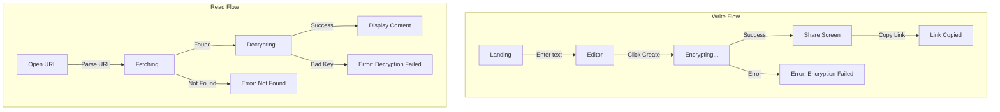

Purpose: MVP user flows for Noslock encrypted pastebin.

# Noslock User Flows (v1 MVP)

## Overview

Two primary flows:
1. **Write Flow**: Create encrypted paste and get shareable link
2. **Read Flow**: Open link and view decrypted content

## State Diagram



## Write Flow (Create Paste)

### Steps

1. **Landing Screen**
   - User sees simple textarea
   - "Create" button below

2. **Enter Content**
   - User types or pastes text
   - No character limit for MVP (practical limit ~60KB due to Nostr event size)

3. **Create Paste**
   - User clicks "Create" button
   - UI shows "Encrypting..." state

4. **Encryption (Client-side)**
   - Generate random 32-byte key (K_doc)
   - Generate random 24-byte nonce
   - Generate random 32-byte doc_id
   - Encrypt content with XChaCha20-Poly1305
   - Combine nonce + ciphertext

5. **Publish to Relays**
   - Connect to default relays
   - Publish event (kind 30078) with d-tag = doc_id
   - Wait for confirmation from at least one relay

6. **Share Screen**
   - Display capability URL: `noslock://doc_id#key_hex`
   - "Copy" button to copy to clipboard
   - Success confirmation when copied

### Write Flow Sequence

```
User                    App                     Relays
  │                      │                        │
  │──Enter text─────────▶│                        │
  │──Click Create───────▶│                        │
  │                      │──Generate key, nonce──▶│
  │                      │──Encrypt──────────────▶│
  │                      │──Publish event────────▶│
  │                      │◀──OK confirmation──────│
  │◀──Show URL───────────│                        │
  │──Copy URL───────────▶│                        │
  │◀──Copied!────────────│                        │
```

## Read Flow (View Paste)

### Steps

1. **Open URL**
   - User receives/pastes capability URL
   - Opens in browser (e.g., `https://noslock.app/doc_id#key_hex`)

2. **Parse URL**
   - Extract doc_id from path
   - Extract key from fragment (#)
   - Key never sent to server

3. **Fetch from Relays**
   - UI shows "Fetching..." state
   - Query relays for event with d-tag = doc_id
   - Use first response

4. **Decrypt Content**
   - UI shows "Decrypting..." state
   - Extract nonce + ciphertext from event content
   - Decrypt with key from URL
   - Verify authentication (Poly1305 MAC)

5. **Display Content**
   - Show decrypted plaintext
   - Simple text display (no formatting for MVP)

### Read Flow Sequence

```
User                    App                     Relays
  │                      │                        │
  │──Open URL───────────▶│                        │
  │                      │──Parse doc_id, key────▶│
  │                      │──Query by d-tag───────▶│
  │                      │◀──Return event─────────│
  │                      │──Decrypt──────────────▶│
  │◀──Display content────│                        │
```

## Error States

### Write Errors

| Error | Cause | User Message |
|-------|-------|--------------|
| `ENCRYPT_FAILED` | libsodium initialization failed | "Encryption failed. Please refresh and try again." |
| `RELAY_UNAVAILABLE` | All relays unreachable | "Could not connect to Nostr relays. Please try again." |
| `PUBLISH_FAILED` | Relays rejected event | "Could not publish paste. Please try again." |

### Read Errors

| Error | Cause | User Message |
|-------|-------|--------------|
| `NOT_FOUND` | Event doesn't exist on relays | "This paste was not found. It may have been deleted or never existed." |
| `DECRYPT_FAILED` | Wrong key or tampered content | "Could not decrypt. The link may be incorrect or the content was modified." |
| `INVALID_URL` | Malformed capability URL | "Invalid link format." |

## Screen Components

### Landing/Editor Screen

```
┌────────────────────────────────────────┐
│              Noslock                    │
│                                         │
│  ┌─────────────────────────────────┐   │
│  │                                 │   │
│  │  [Textarea for content]         │   │
│  │                                 │   │
│  │                                 │   │
│  └─────────────────────────────────┘   │
│                                         │
│         [ Create Paste ]                │
│                                         │
└────────────────────────────────────────┘
```

### Share Screen

```
┌────────────────────────────────────────┐
│           Paste Created!                │
│                                         │
│  ┌─────────────────────────────────┐   │
│  │ noslock://abc123...#def456...   │   │
│  └─────────────────────────────────┘   │
│                                         │
│         [ Copy Link ]                   │
│                                         │
│  Anyone with this link can view         │
│  the content. Share carefully.          │
│                                         │
│         [ Create New ]                  │
└────────────────────────────────────────┘
```

### Reader Screen

```
┌────────────────────────────────────────┐
│              Noslock                    │
│                                         │
│  ┌─────────────────────────────────┐   │
│  │                                 │   │
│  │  [Decrypted content displayed]  │   │
│  │                                 │   │
│  │                                 │   │
│  └─────────────────────────────────┘   │
│                                         │
│         [ Create New ]                  │
└────────────────────────────────────────┘
```

## Out of Scope for MVP

These features are explicitly not in v1:

- Syntax highlighting
- Manual relay selection
- Link expiration / burn-after-read
- Edit or versioning
- Link revocation
- QR codes
- NIP-44 encrypted link sharing
- User accounts or saved pastes
- Rich text / markdown rendering
